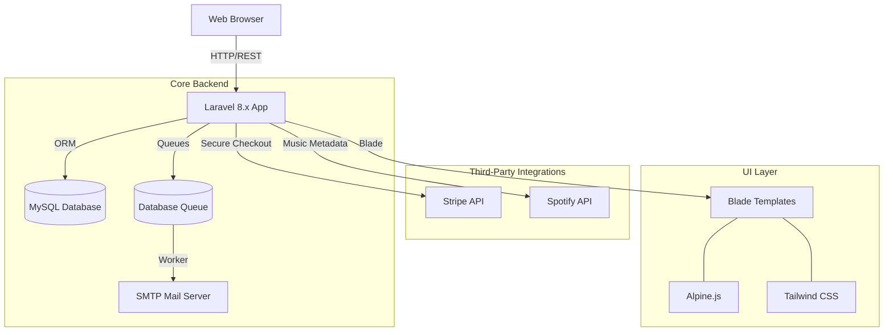

# 🎫 Event Ticketing & Merchandise Store

[](https://laravel.com)
[](https://stripe.com)
[](https://developer.spotify.com/)
[](https://www.mysql.com/)

A comprehensive Full-Stack platform designed to streamline event management, performer engagement, and secure ticket purchasing. Built with **Laravel**, this enterprise-ready system integrates real-time music discovery via Spotify and secure payment processing via Stripe, all while maintaining high performance through asynchronous task handling.

---

## 🏗️ System Architecture

The application is built on a robust monolithic architecture with external service integrations and background job processing:



---

## ✨ Key Features

### 👔 Admin Intelligence Dashboard
*   **Live Metrics**: Real-time tracking of **Total Revenue**, **Total Orders**, and platform activity (Events, Performers, Categories).
*   **Centralized Control**: Unified administrative interface to manage the entire merchandise stock, category hierarchies, and user accounts.
*   **Order Management**: Detailed tracking of ticket purchases with the ability to update order statuses and manage single-use discount codes.

### 🛡️ Secure & Optimized Backend
*   **Asynchronous Processing**: Leverages **Laravel Queues** for background job processing. Ticket confirmation emails are dispatched off the main thread, ensuring a zero-lag checkout experience.
*   **Music-Enhanced Profiles**: Deep integration with the **Spotify API** to automatically fetch and display performer top tracks and previews, enriching the event discovery process.
*   **Enterprise Security**: Custom authentication middleware, role-based access control (Admin/User), and secure session management.

### 💳 Seamless Ticketing Experience
*   **Stripe Integration**: Professional payment flow with **Stripe Checkout**, supporting secure 3D-secure transactions and automated order fulfillment.
*   **Dynamic Promo Engine**: Modular system for managing percentage-based discount codes with expiration dates and single-use constraints.

---

## 🛠️ Application Ecosystem

| Component | Responsibility | Primary Tech |
| :--- | :--- | :--- |
| **Authentication** | Custom User Auth & Admin Middleware | Laravel Auth |
| **Payments** | Ticket bookings and secure fulfillment | Stripe SDK |
| **Music Data** | Performer enrichment & track previews | Spotify Web API |
| **Messaging** | Asynchronous ticket delivery & notifications | Laravel Queues |
| **Storage** | Relational data management & caching | MySQL + Redis (Optional) |
| **Frontend** | Responsive & Interactive UI | Tailwind + Alpine.js |

---

## 🚀 Getting Started

### 1. Prerequisites
Follow these requirements before setting up the project:
*   **PHP 7.4+** and **Composer**
*   **Node.js 16+** and **npm**
*   **MySQL Database** for storage

### 2. Installation & Setup

**Clone the repository**
```bash
git clone https://github.com/vipultikhe234/Event-Ticketing-and-Merchandise-Store.git
cd event-ticketing
```

**Install Backend Dependencies**
```bash
composer install
```

**Install Frontend Dependencies**
```bash
npm install && npm run dev
```

### 3. Environment Configuration
Copy the `.env.example` to `.env` and configure your credentials:
*   **Database**: Set `DB_DATABASE`, `DB_USERNAME`, and `DB_PASSWORD`.
*   **Stripe**: Configure `STRIPE_KEY` and `STRIPE_SECRET`.
*   **Spotify**: Add `SPOTIFY_CLIENT_ID` and `SPOTIFY_CLIENT_SECRET`.

### 4. Database & Queues
Initialize the database and start the background workers:

**Generate Application Key**
```bash
php artisan key:generate
```

**Run Migrations & Seeders**
```bash
php artisan migrate --seed
```

**Start Queue Worker**
```bash
php artisan queue:work
```

---

## 🔒 Security Configuration
The project utilizes strict environment control for sensitive data. Ensure you have the following keys properly configured:
*   `APP_KEY`: Essential for session security and data encryption.
*   `STRIPE_SECRET`: Required for secure server-side payment verification.
*   `SPOTIFY_CLIENT_SECRET`: Used for restricted API authentication.

---

## 📂 Project Structure
```text
.
├── app/Http/Controllers/  # core Logic (Checkout, Events, Admin)
├── app/Models/            # Database Entities
├── app/Jobs/              # Asynchronous Tasks (Ticket Delivery)
├── database/migrations/   # Database Schema Definitions
├── resources/views/       # Blade Templates & Components
├── routes/                # Web & API Route Definitions
└── tailwind.config.js     # Design System Configuration
```

---

## 🛡️ License
Distributed under the MIT License. See `LICENSE` for more information.

---

Developed with ❤️ by **[Vipul Tikhe](https://github.com/vipultikhe234)**
